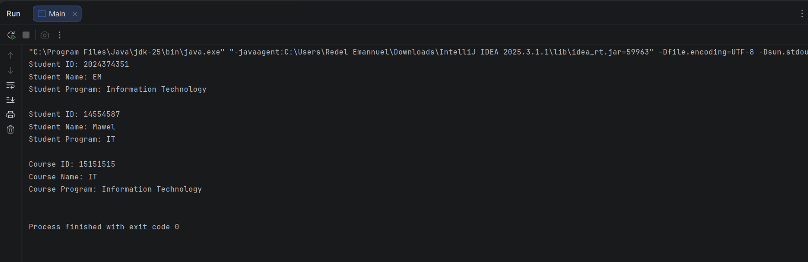
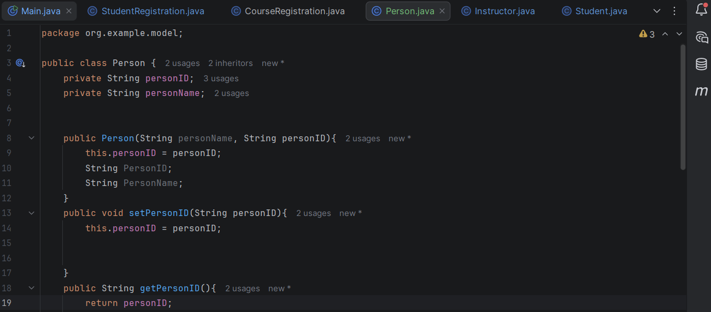
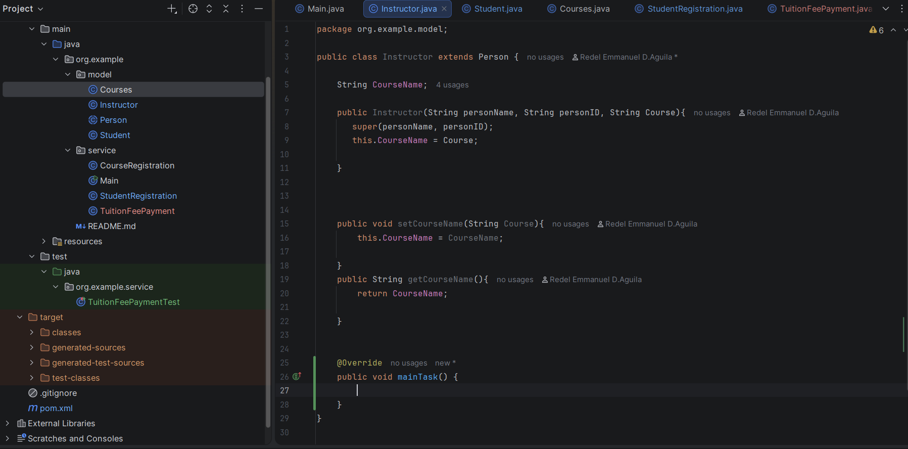
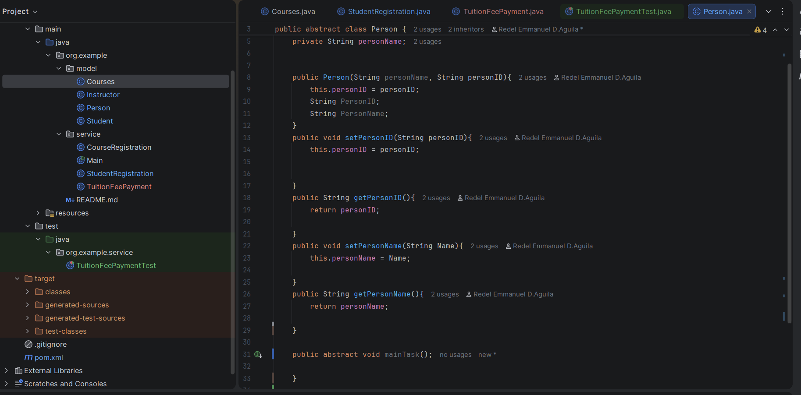
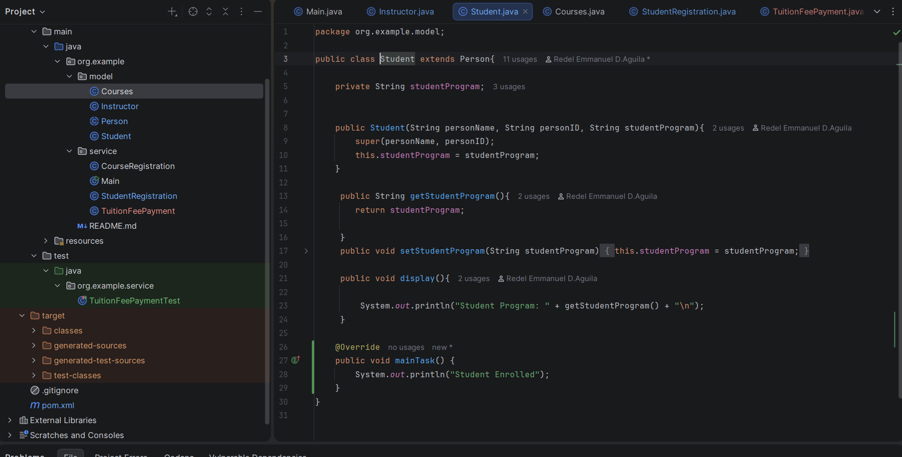

# OOP ENROLLMENT SYSTEM
Author: Redel Aguila

---

Project Vision and Architectural Thinking

This project represents a transition from basic procedural coding to a Modular Software Architecture. The Enrollment System is built on a Service-Oriented structure where data models are strictly separated from business logic services. This decoupling ensures that the system is scalable, organized, and easy to maintain, mirroring how professional enterprise applications are built.

The OOP Evolutionary Roadmap

I established a robust identity hierarchy starting with the Person base class. By using private access modifiers and public getters and setters, I ensured strict Encapsulation which protects sensitive data like Student IDs and Instructor records. The Student and Instructor classes utilize super constructors to inherit core identities while maintaining their unique attributes such as student programs for students and departmental data for instructors.

To maintain logical consistency, I defined the Person class as an Abstract Class. The logic here is that an entity cannot simply be a generic person in this system; they must have a specific role. By defining an abstract method like mainTask, I forced the system to recognize that every entity must have a professional function. For the Student, the implementation focuses on academic learning, while for the Instructor, the implementation focuses on educational instruction.

Through method overriding, the system demonstrates Polymorphism. The display method behaves differently depending on whether it is called by a Student object or a Courses object. This allows the Main controller to handle different object types uniformly while executing their specific logic.

Complex Institutional Mapping and Business Logic

The project successfully maps real-world academic relationships through entity linking and capacity management. Using the maxCapacity and enrolledCount logic in the Courses model, the system tracks real-time availability to ensure that enrollment does not exceed institutional limits. One of the core features is the TuitionFeePayment service, which handles the financial engine of the university. It performs unit-based calculations where fees are dynamically calculated based on the number of units in a Courses object. This ensures financial integrity by linking every transaction to a specific student record.

Quality Assurance and Technical Stack

To ensure the system is production-ready, I implemented a suite of Automated Unit Tests using JUnit 5. Each test follows the Arrange, Act, and Assert pattern. Specifically, I developed tests to verify the tuition calculation logic, ensuring that the system produces accurate financial data. The technical stack for this project includes Java JDK 21, JUnit 5 for testing, Maven as the build tool, and Git for version control using a Feature Branch Workflow involving Main, FINALS, and specific feature branches.

## **Encapsulation**

## **Inheritance**

## **Abstract**

## **FINALS**

## model
Courses

Database

Department

Instructor

Person

Section

Student

TuitionFeePayment

## service

ICourseService

IEnrollmentService

IInstructorService

IStudentService

ITuitionService

EnrollmentServiceImpl

TuitionServiceImpl

CourseServiceImpl

InstructorServiceImpl

StudentServiceImpl

## test

CourseRegistrationTest

EnrollmentServiceTest

InstructorServiceTest

StudentRegistrationTest

TuitionFeePaymentTest

JUnitTesting

Main
